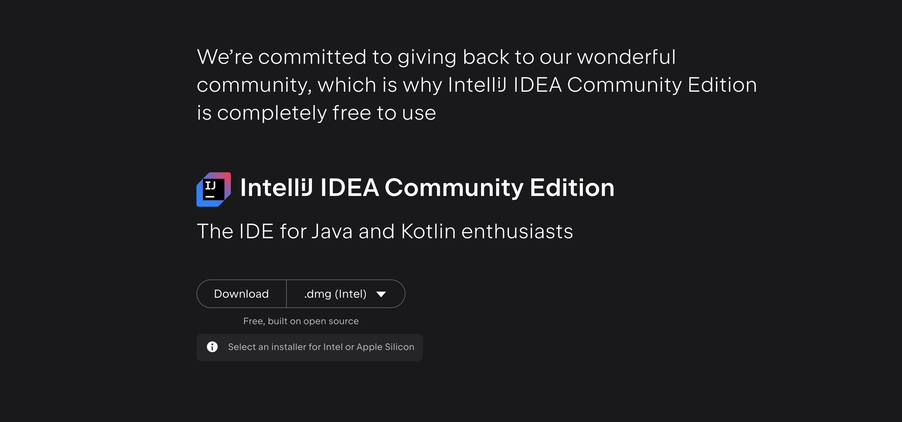
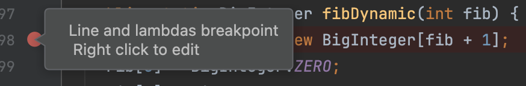
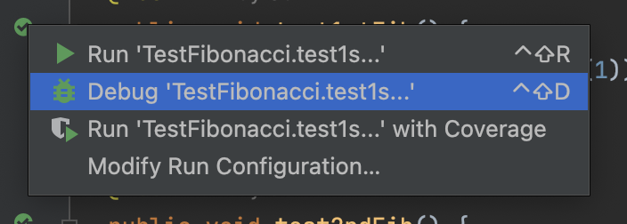
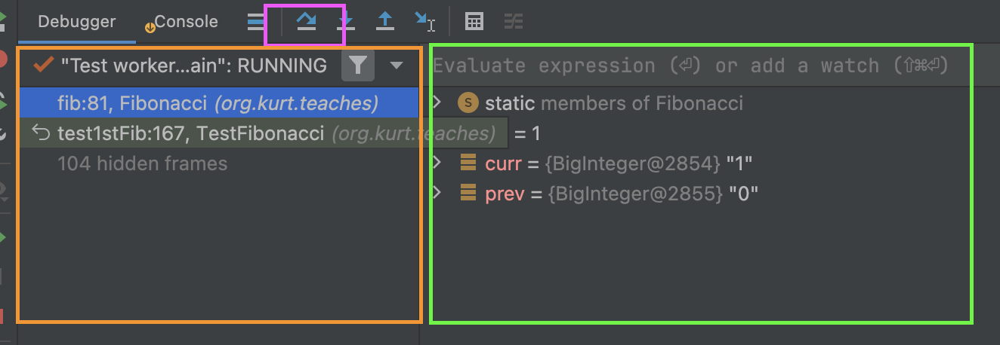
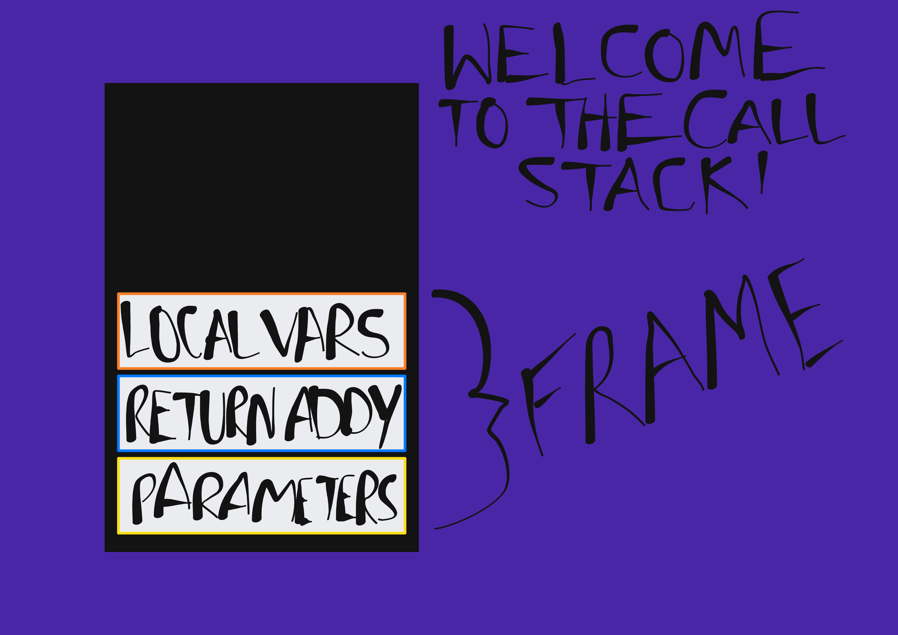

Start your Test Driven Development Journey Here
===============================================

You can write a whole bunch of code, but without tests it's very hard to know you satisfied all cases your program will encounter without manually testing each one. Without automated testing you will have to run every single test case manually each time you want to make a change! It is best to write tests once each time you add a new feature. Test Driven Design suggests the ideal behavior is to write the test before implementing a feature. Start out with it failing and then work to get it to pass.

Exercises
---------

There is one test failing in this test suite! It's your job to diagnosis it!

### Run Tests From the Terminal:

The terminal is how to interface with your computer without a GUI (graphical user interface). A terminal is also called a command line. And tools called CLIs or command line interfaces are run against them.

1.  Download the [source code.](https://github.com/ksell8/algorithms.git).  
    To get the source code on to your computer you need to install a tool called git. It is likely git will already exist on your computer. You can check by entering `which git` in your terminal (on windows use `where git` or hop into Powershell).  
    If it exists congrats, run `git clone https://github.com/ksell8/algorithms.git`.  
    Else, case(operating\_system):
    *   Mac: if you have xcode: `xcode-select --install` // will install xcode command line tools  
        else if you have brew: `brew install git`  
        else: install xcode from App Store or brew with `bin/bash -c "$(curl -fsSL https://raw.githubusercontent.com/Homebrew/install/HEAD/install.sh)"`
    *   Linux: it depends what flavor of Linux you have. That distribution will have a package manager and with that package manager you can install git. Look up "how to install git on \[insert linux distribution\]" and there should be answers. But once you find your package manager it's a good bet the package is called git.  
        If you don't know what Linux distribution you are running run: `cat /etc/os-release`. The linux distribution is the Name.
    *   Windows: Install using [Git for Windows](https://gitforwindows.org/).
2.  OK, you should have a folder now called algorithms! Run `ls` or `dir` on windows to list the files in your current working directory. If algorithms does not exist, try cloning again with git.  
    We are going to change directory into the algorithms folder using: `cd algorithms`. On Windows the ls equivalent is `dir`.  
    Once you are in the folder run `ls -R` or `dir /s`. This will recursively list all the files from the root of the project.  
    You should see the following hierarchy.

    ```
    .
    ├── src/
    │   ├── main/
    │   │   └── java/
    │   │       └── org/
    │   │           ├── you/
    │   │           │   └── code/
    │   │           │      
    │   │           └── kurt/
    │   │               ├── teaches/
    │   │               │   ├── Fib/
    │   │               │   │   ├── Fibonacci.java
    │   │               │   │   └── BigNumbers.java
    │   │               │   
    │   │               └── answers/
    │   │                   
    │   └── test/
    │       └── java/
    │           └── org/
    │               ├── you/
    │               │   └── code/
    │               │       
    │               └── kurt/
    │                   └── teaches/
    │                       └── TestFibonacci.java
    ├── .pre-commit-config.yaml
    ├── build.gradle.kts
    ├── properties.gradle.kts
    ├── gradlew
    ├── gradle.bat
    └── .gitignore
    ```

3.  Run the tests with Gradle.  
    On nix (Mac, Linux) flavors run the following:

    `./gradlew build`


    On Windows flavors run:

    `execute gradlew.bat build`

    Once you've identified the failing test run only that test:

    `./gradlew test --tests org.kurt.teaches.TestFibonacci.FAILING\_TEST\_NAME`

### Diagnose with IDE Debugger:

IDE stands for Integrated Development Environment. This tutorial will help you get one setup and you'll learn how to use the debugger!

1.  Install the [Community Edition of Intellij](https://www.jetbrains.com/idea/download/) (it's free -- don't download ultimate by accident)!  
    ](https://www.jetbrains.com/idea/download/)

2.   Click the green arrow next to the class definition to run all the tests.  
     The failed test you identified from your terminal should now show up as failed. Click the run on the icon next the failing function name to only run that test.
3.  Add a breakpoint to the first line of the function in Fibonacci.java with the failed test.  
      
    Clicking the margin next to the line number will add a breakpoint to the execution for debugging purposes. We will be able to look into the state of the program and determine the cause for failure.

4.  Debug the failing test by right clicking the green arrow and clicking debug. 

    This will allow the debugger to halt at the breakpoint you added. The debugger should pop up at the bottom of your IDE, if not navigate to the lower left corner and click the Debug icon. Your screen should look like: 

    Clicking on the step-over button (denoted by the pink box) steps to the next step of the function being debugged, step-into (which is next to it) will step-into the function being called which may use implementations outside of the function being debugged.  
      
    As you click through the function you will see


Once you've identified the issue try to fix it in org.kurt.teaches.Fibonacci, rerun the tests until you pass! Ensure all tests pass! You can fix the failing test and fail different tests in turn. Be careful!