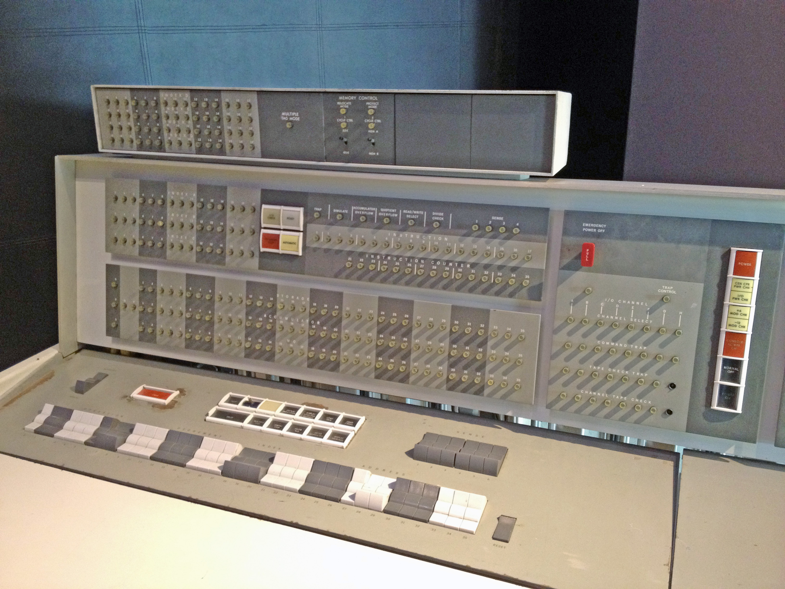

# What is a Computer?

In 1936 Alan Turing wrote *On Computable Numbers* which built on the previous
work of Ada Lovelace and others to create a computational model that is equivalent
to that of the machine you are reading this from.  The model was made of an 
infinite tape.  The tape could be written to, read from and moved along.

Turing wanted to mimic what a human could do when computing a
mathematics problem. The computers of his time were mathematicians who did computations by hand.
Turing wished to automate that away (this will be a reoccurring theme).  And so the infinite tape was born,
for if all a human does is write, erase and read figures, surely an automatic process could 
mimic a human computer by doing the same!

Let's solve a very simple problem together to see how we would convert it for a machine to solve.

```equivalence problem
Given a two sentences as input, determine if the sentences are the same.
If they are, accept, otherwise reject.
```

How would a human solve this? Take for example the following input: "The cat sat." and "The cat sat.".
Easy peasy, we'd see it and accept.  But what if you were given two sentences that were 500,000 characters long?
Could you tell me with certainty the sentences matched by eyeballing it?  How could you prove they matched?

I'd go character by character down both the sentences until I found a character that did not match.

All that takes is moving and reading!  So Turing's model can handle it!

TODO: add stuff about transition tables?/binary -- simpler than writing transition for everything?

I know what, you're thinking: How is an infinite tape I can read and write to equivalent
to my iPhone/Android? My Mom's favorite thing to do on her iPhone is play Candy Crush.

Let's try to automate away one sub-problem of Candy Crush with only read, write and move operations.

```Candy Crush
Given an nxm matrix called of items determine if a possible move exists.

A possible move is defined as:
Swapping an element with it's surrounding element will create a line of
3 or more of the same type of element.

Examples:

- Moves exist

r g r r
g r g r
g r r b

Sample moves:

NOTE:
Notation for these sample moves is based on the following Battleship grid:
  0 1 2 3
0   x
1
2
The x in the map above is at (0, 1).  We always give (row number, column number)
because in Java we will store the matrix as a list of rows.  You have to fetch
the nth row and then fetch the nth item within that row.  

int[][] exampleMatrix = { { r, g, r, r },{ g, r, g, r },{ g, r, r, b } };

(0,1) swap with (1,1)
(0,1) now in-line with (0,0) (0,2) and (0,3)
(1,1) now in-line with (1,0) (1,2)

(0,0) swap wih (0,1)
(0,1) now in-line with (0,2) (0,3) (1,1) (1, 2)
(0,0) now in-line with (1,0) (2,0)

Moves don't exist: 
g b r y
r g b g
b y r y
```

Do you see a pattern in when a move exists and when it doesn't? 
It seems if a move exists then there are 2 or more like items
surrounding a matching element including diagonals.

How do you get the diagonals?  You add or subtract 1 from both the row
number and the column number!  If you're just moving in up, down, side-to-side
you only modify one dimension at a time.  So we could visit each item,
write down the neighboring items.  If 2 or more are equivalent to the element
we are currently processing then accept, otherwise continue. 

So storing information and doing different things based on what's stored seems
to be a robust enough model to solve cool problems with.  How did we get from a
theoretical infinite tape to the smartphone though?

PUNCH CARDS?

MACHINE CODE

MAINFRAME CONSOLES and COMPUTER OPERATORS




[Machine Code vs. Assembler](https://www.youtube.com/watch?v=HWpi9n2H3kE)

ASSEMBLER 

This was tedious work, and it made computers largely unavailable
except within government and university applications.  Around 1947
a very smart lady by the name of Kathleen Booth was working on a computer
at her university when she came up with the idea to automate away some of the drudgery.
There were only a certain set of operations 

HIGHER LEVEL LANGUAGES - C

JAVA BYTECODE, JVM, JIT

[De-Mystifying JiT Compilers](https://www.youtube.com/watch?v=d7KHAVaX_Rs)

